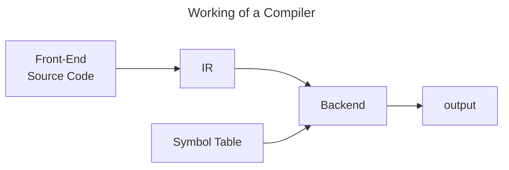

# Symbol Table
- Data structure
- Hold info about variables and identifiers
- Table is slowly populated
>[!note] 
> Scope - Region where the symbol is visible


```c
int a = 10;
```

| Name | Type | Value | Scope |
| ---- | ---- | ----- | ----- |
| a    | int  | 10    | main  | 

# Working of a Compiler



