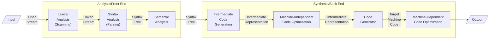
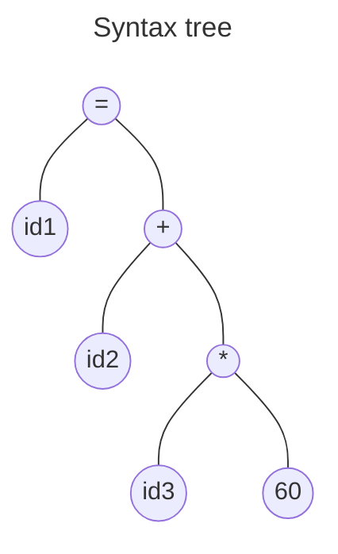
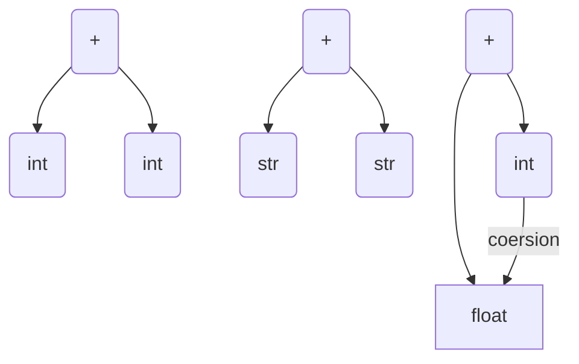
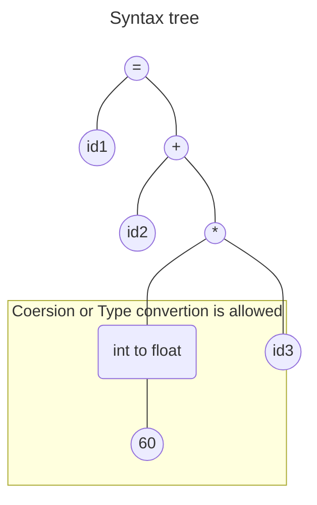
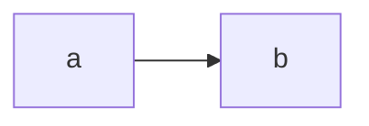

---
## Lexical Analysis
- A [Lexical Analyzer](03%20Lexical%20Analysis.md) finds stuff like `keywords, idetifiers, operators, symbol, numeric const, string const`
- Token is in the form `<TOKEN_NAME, VALUE>` where value is **optional**
- [Symbol Table](00%20Working%20of%20a%20Compiler.md#Symbol%20Table) is used for identifiers
- It generates a token stream
 ```
 (id)identifier -> <ID, PTR_TO_SYMBOL_TABLE>
 (OP)operator -> <OP,+>, <OP,-> (OR) <+>, <->
 (SYM)symbol -> <SYM,;>
```
---
## Syntax Tree
- It builds a tree like structure
- Check if token stream i according to the grammar of the programming language


---
## Semitic Analysis
- Syntax tree is semantically consistent with the specification of the programming language
- Type Checking - Checks if the operands are compatible or not
### Examples
1.  Array Index ==> int
2.  Type conversions while using operators 

---
## Intermediate code generation
- Generates a Low level machine language program(almost)
- Three address code *(3 A C) / (T A C)*
>[!important] 
>Every instruction should have a maximum of three address.

*Assume pos, init, are floating point*


The compiler makes temp variables as many temp variables as necessary
```c
t1 = inttofloat(60)
t2 = id3 * t1 # always have one operator (3 a c)
t3 = id2 * id1
id = id3
```
---
## Code optimization
- Intermediate code ==> better code (faster, small size, less power)
```c
t1 = ids * 60
id1 = id2 + t2
```



## Questions
1. a = b * (c/12) / (1- (1 + (c/12) + (-d* 12))

**Token generated:**
`<id1,1> <=> <id2,2> <> <(> <id3,3> </> <12> <)> </> <(> <1> <-> <(> <1> <+>> <<> <id3,3> </> <12> <)> <+> <(> <-> <id4,d> <> <12> <)> <)>`
 **Syntax tree:**

**Intermediate Code Generation**
```c
t1 = id3 / 12               t6 = -id 4
t2 = id2  * t1              t7 = t6 * 12
t3 = id3 / 12               t8 = t5 + t7
t4 = 1 + t3                 t9 = t2 / t8
t5 = 1 - t4                 id1 = t9
```
  **Optimized Intermediate Code**
```c
t1 = id / 12                t5 = -id4
t2 = id2 * t1               t6 = t5 + 12
t3 = 1 + t1                 t7 = t4 + t6
t4 = 1 - t3                 id1 = t2 / t7
```

```asm
lea b
mov 12,2
```