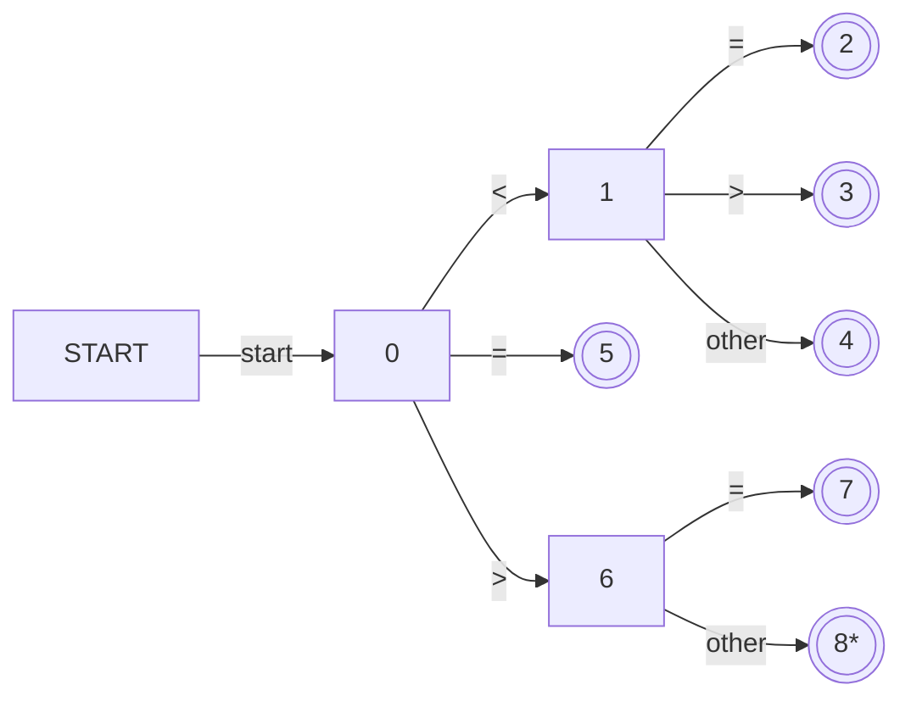
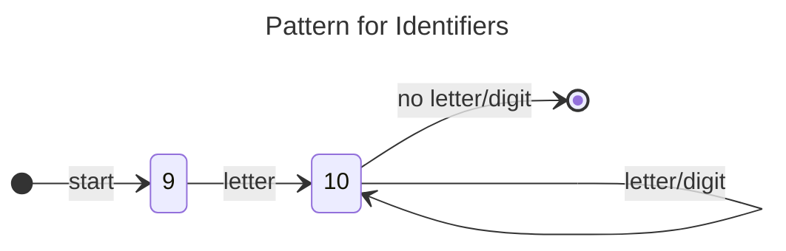
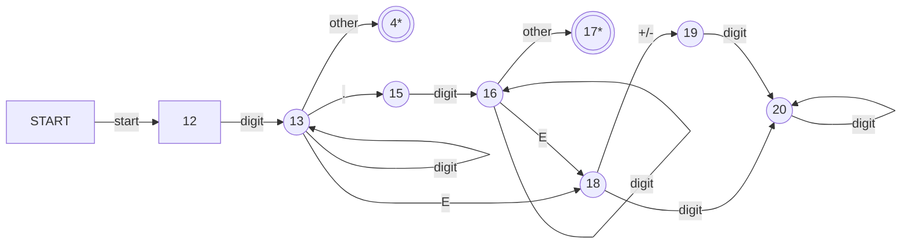

Refer for [Lexical Analysis](01%20Phases%20of%20Compiler.md#Lexical%20Analysis)
Sentinels - They are marker symbols
Lexeme - Placed at he starting point of the buffer

## Input Buffer
- In the case of `**` (which is used for exponents), it 1st scans the 1st `*` and then looks one char ahead to see if there is another `*` this is called look ahead.
```c
switch(*forward++){
	case eof:
		if(forward is at the end of first buff){
			reload second buffer;
			forward =  beginning of second buffer;
		}
		else if(forward is at the end){
			reload first buff;
			forward = beginning of 1st buff;
		}
		break;
	case for other buffers
}
```

---
## Lexical Errors
If the analyzer is unable to proceed because none of the patterns for tokens matches any prefix of the remaining input 

### Panic mode
Keep deleting until the lexical analyzer can find a well formed token

---

## Strings and Languages
- Alphabet
	- Set of finite symbols, represented by $\sum$
	- Eg {0,1} or {all ascii characters}
- Language
	- Any countable set of strings over an alphabet
- Strings
	- (s) = banana, |s| = 6
	- Empty string $\epsilon$
	- Anything that has proper in the start will not consider the $\epsilon$ 
- Sub strings
	- Strings formed by deleting zero or more not necessarily consecutive 
## Operations on Strings and Languages

- Operation on Strings
	- Concatenation $\epsilon s=s\epsilon = s$
	- Exponentiation
- Operation on Languages
	- Union
	- Concatenation 
	- Closure
	- all similar to set operations

L = {A,B,...Z,a,b,...,z}
D={0,1,...9}

Operations that can be performed
1. Union
	- {A,B,...Z,a,b,...,z,0,1,...9}
2. Concatenation
	- {A0,A1...A9, B0,B1...B9, a0,a1,...a9,b0,b1,...b9....etc}
3. Closure
	- Includes empty string
## Regular Expression

- Basic Rules
	- $\epsilon$ is a RE and $L(\epsilon) = {\epsilon}$, means a lang whose member is an empty string.

Example - Let $\sum={{a,b}}$

1. The regular expression a|b denotes the language {a,b}
2. (a|b)(a|b) denotes {aa,ab,ba,bb}
3. $a^*$ denotes the language consisting of all strings of zero or more a's i.e {$\epsilon$, a,b,a,a,aaa...}
## Regular Definition
For notional convenience, give names to certain regular expressions and use those names in subsequent expressions
## RE for identifiers in C
1. Letter -> A|B|.....|Z|a|b|....|z|
2. Digit -> 0|1|...|9
3. id-> letter(letter|digit)*

### Unsigned Numbers: (int,float)
12, 12.24, 12E10, 12E-10

1. digit -> 0|1|...|9
2. digits -> digit digit*
3. opt_frac -> (.digits) | $\epsilon$
4. opt_exp -> (E(+|-|$\epsilon$) digits) | $\epsilon$
5. un_no -> digits opt_frac opt_export

### Additional operators
1. Positive closure
	- left associative, same precedence as *
2. ? -> 0 or 1 occurrence 
3. Character 
	- letter -> [a-Z a-z]
	- digit -> [0-9]
	- id -> letter(letter|digit)*
	
### Unsigned Numbers: (Using other operators)
digit -> [0-9]
digits -> [0-9]+
opt_fraction -> (.digits)?
opt_exp -> (E[+ -]? digits)?
un_no -> digits opt_frac opt_exp

## Transition diagrams
- Regular expression can be translated into transition diagrams and then it is converted to code
- Transition Diagrams are Finite State Machines
- Double circle: accepting or final state

### Pattern for **Relop**
relop -> < | > | $\le$ | $\ge$ | = | <>


### Pattern for **Identifiers**
id -> letter(letter|digit)*



| incoming | reserved | token |
| -------- | -------- | ----- |
| then     | reserved | then  |
| else     | reserved | else  |
| if       | reserved | if    |
| initial  |          |       | 

### Patters for **numbers**
no -> digits(.digits)? (E[+ -]? digits)



