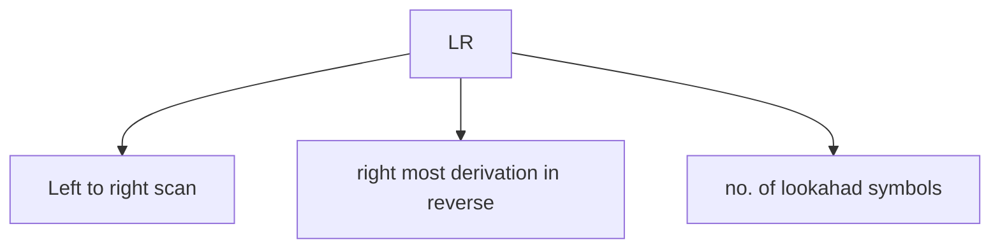
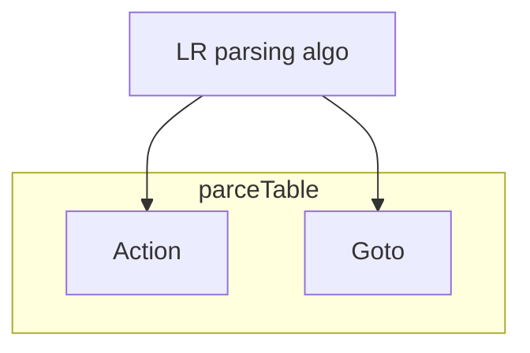

```mermaid
flowchart TD

LR-->l[Left to right scan]
LR-->r[right most derivation in reverse]
LR-->n[no. of lookahad symbols]
```

## Schematic of LR Parser

```mermaid
flowchart TD
LR[LR parsing algo]
subgraph parceTable
Action
Goto
end

LR-->Goto
LR-->Action
```
