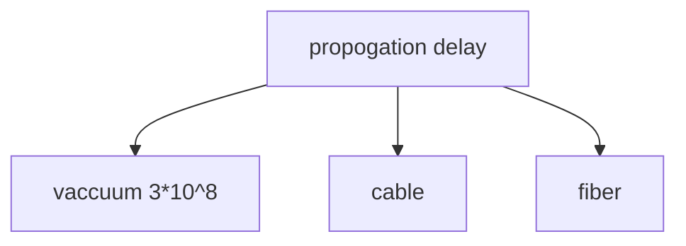

The time required transmit a packet along its enter path

### Transmission Delay 
The time required to push all the bits in a packet on the transmission medium in use

### Propagation delay
- Once a bit is 'pushed' on the transmission medium, the time required for the bit to propagate to the end of its physical trajectory 

### Processing Delay
Required toe to analyze a packet header and decide where to send the packet

### Example 1
What is the propagation time if the distance between the two points is 12,000km? Assume the propagation speed to $2.4*10^8$
Answer: 
$\frac{12,000*1000}{2.4*10^8}$

### Example 2

How long does it take to send a file of 640,000 bis from host A to host B over a circuit-switched network?

For a TDM link, time is divided onto frames of fixed duration and each frame is divided into a fixed number of time slots. When the network establish connection across a link, the network dedicates one time slot in every frame to connection These slots are edicated for the sole use of that connection, with a time slot available for use to transmit the connection's data.

Each circuit has a transmission rate of 64kbps so it takes 10 sec. to transmit the file, To this 10 seconds we add the circuit establishment time, giving 10.5 seconds to send the file. Note that the transmission time is independent to the number of links. 