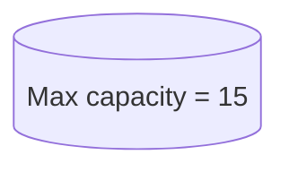

### Problem 1

| item | weight | value | profit | ranking | item | 
| ---- | ------ | ----- | ------ | ------- | ---- |
| 1    | 5      | 30    | 30/5   | 1       | X1   |
| 2    | 10     | 49    | 49/10  | 2       | X2   |
| 3    | 15     | 45    | 45/15  | 5       | X3   |
| 4    | 22     | 77    | 77/22  | 4       | X4   |
| 5    | 25     | 90    | 90/25  | 3       | X5   |

| Objects | Highest P/W ratio | weights | capacity |
| ------- | ------------------ | ------- | -------- |
| X1      | 6                  | 5       | 60-5=55  |
| X2      | 4                  | 10      | 55-10=45 |
| X5      | 3.6                | 25      | 45-25=20 |
| X4      | 2.5                | 20      | 20-20=0  | 

$\sum x_iw_i = 60$
$\sum x_ip_i = 230$

---

### Problem 2
- Ranking is based on profit

| Items | Value | Weight | Profit | Ranking |
| ----- | ----- | ------ | ------ | ------- |
| 1     | 60    | 10     | 6      | 1       |
| 2     | 100   | 120    | 5      | 2       |
| 3     | 120   | 30     | 4      | 3       | 

| Object | Highest P/W ratio | Weights      |
| ------ | ----------------- | ------------ |
| X1     | 6                 | 10(50-10=40) | 
| X2     | 5                 | 20(40-20=20) |
| X3     | 4                 | 0(20-20=0)   |

- $\sum x_iw_i= (1*10)+(1*20)+(\frac{2}{3}*10)$  i dont know
		= 10+20+20 = **50KG**
- $\sum x_ip_i= (1*60)+(1*20)+($ 

### Problem 3

| Object | Profit | Weight | Profit/Weight | Ranking |
| ------ | ------ | ------ | ------------- | ------- |
| 1      | 5      | 1      | 5             |         |
| 2      | 10     | 3      | 10/3          |         |
| 3      | 15     | 5      | 5             |         |
| 4      | 7      | 4      | 7/4           |         |
| 5      | 8      | 1      | 8             |         |
| 6      | 9      | 3      | 3             |         |
| 7      | 4      | 2      | 2             |         |

$\sum x_iw_i = 15$
$\sum x_ip_i = 51$
