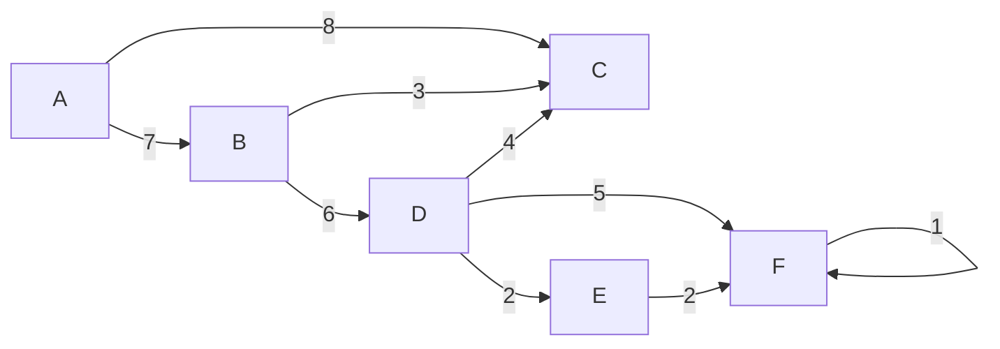

1. Algorithm used to find minimum cost spanning tree for connected weighted undirected graphics
2. Choose any arbitrary vertex
3. Chosen edge to MST should not form a cycle
4. Graph can have more than 1 spanning tree
5. G(V,E)
6. MST - G'(V',E')

- Remove loops and parallel edges
- Choose any node as root node

Choose the smallest

| node | edges               |
| ---- | ------------------- |
| A    | 7,**8**             |
| B    | ~~7~~,~~3~~,6       |
| C    | 8,~~3~~,~~4~~,~~5~~ |
| E    |                     |
