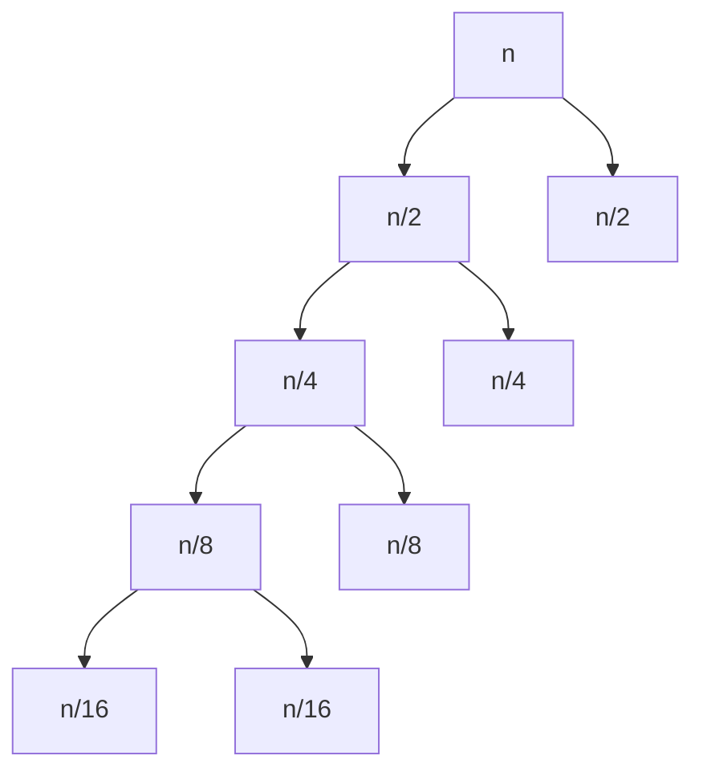

## Proof by recursion tree

Work out the computational complexity of the following piece of code 
```c
for(int i=n;i>0;i/=2){
	for(int j=1;j<n;j*=2){
		for(int k=0;k<n;k+=2){
			// constant number of opeations
		}
	}
}
```

- 1st for loop is $\log_2n$ times
- 2nd loop is $\log_2n$ times
- 3rd loop is $\frac{n}{2}$ times


Height of the tree is 4

1. 3  for loops
2. outer for loops
	1. i keeps halving = $log_2n$ times
3. inner for loop 
	1. j keeps doubling = $\log_2n$ times
4. k increments by 2 = $\frac{n}{2}$ times
5. loops are nested
6. bounds are multiplied
7. $\frac{n}{2}*\log_2n*\log_2n$
8. $\frac{n}{2}*(\log_2n)^2$

>[!note] Answer
>$O(n(\log_2n)^2)$


| Notation  | symmetric | reflex | transitive |
| --------- | --------- | ------ | ---------- |
| Big O     | no        | yes    | yes        |
| Big 0mega | no        | yes    | yes        |
| Big Theta | yes       | yes    | yes           |

| Statement               | Ans   | formula                      |
| ----------------------- | ----- | ---------------------------- |
| $O(f+g)=O(f)+O(g)$      | False | $max\lbrace O(f),(g)\rbrace$ |
| $O(f.g)=O(f).O(g)$      | True  |                              |
| $5n+8n^2+100n^3=O(n^4)$ |       |                              |
|  $5n+8n^2+100n^3=\frac{n}{2}*(\log_2n)$                        |       |                              |
