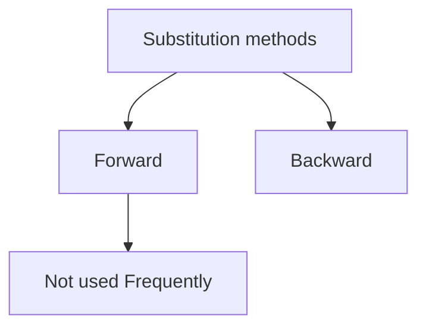

It is an equation that defines an equation recursively

- [Forward Substitution](07%20Recurrence%20relation.md#Forward%20Substitution) - Uses the initial condition in the the initial term and the value for the next term is generated.
- Backwards Substitution - Backwards values are substituted recursively.

## Forward Substitution 
$T(n)=T(n-1)+n$
$T(0)=0$

$n=1$
$=T(1-1)+1$
$=T(0)+1$
$=1$
$f(c)= d$