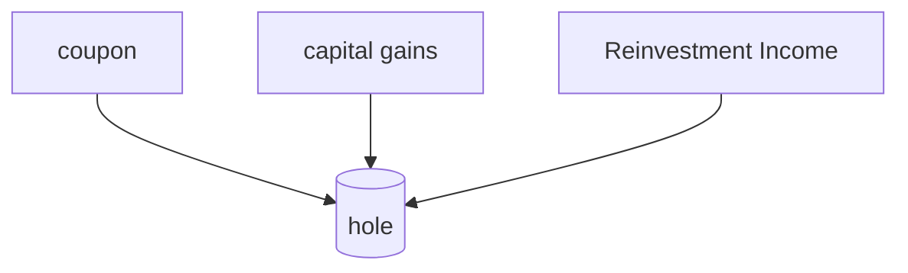

When interest rate is low means more borrowing and more production.
Inflation - when there is extra money in the market. Purchasing power of the money gets reduced.

## Yield to Maturity(YTM)

All the gains made in a fixed investment deposit is called YTM

## Time Value of money(TVM)
