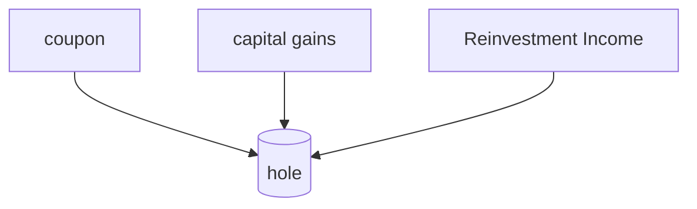

When interest rate is low means more borrowing and more production.
Inflation - when there is extra money in the market. Purchasing power of the money gets reduced.

Interest = inflation+compensation for waiting+risk

## Yield to Maturity(YTM)

All the gains made in a fixed investment deposit is called YTM
## Future Value
Future value of Rs. 100 = $FV=100*(1+r)^t$
$(1+r)^t$is called the multiplying factor

When looking in the future then we should multiply or else divide 

When the rate of return increase then the present value decrease