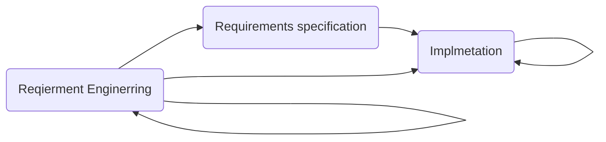

- Dissatisfaction with the overheads involved in software design methods of the 1980s and 1990s led to the creation of agile methods. 
	- Focus on the code rather than the design
	- Are based on an iterative approach to software development 
	- Are intended to deliver working software quickly and evolve this quickly to meet changing requirements. 
 
 - The aim of agile methods is to reduce overheads in the software process and to be able to respond quickly to change requirement without rework
## Agile manifesto
- Individuals should interact with each other
- Customer involvement at all phases
- Deliver the software in functional increments
- Focus on the people and not the software
- Make the program easy to maintain and debug
- Make the code easy to understand

## Agile method applicability
- **Product development** where a software company is developing a **small or medium-sized product** for sale.
- Follow the rules and regulations before making the application public
- Agile methods cannot be used for large systems

## Problems with agile methods
- It can be difficult to keep the interest of customers
- Some team members won't cooperate
- Prioritizing changes can be difficult 
- Contracts may be a problem

