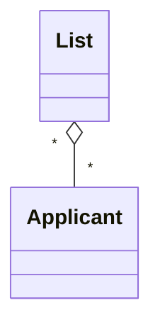
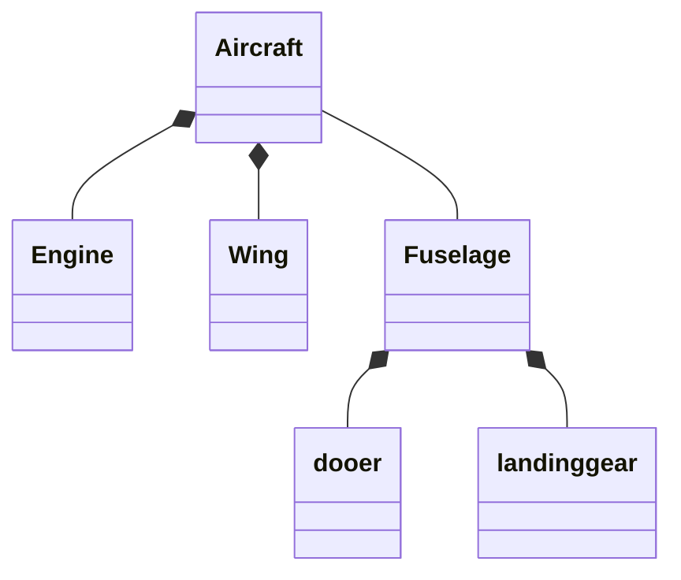

# Methods
Operations,behavior, services
- Behavior refers to those things that the object can do and which correspond to functions that act on the objects's data
- An object is solely responsible for carrying out any functions or behaviors that act upon its own data
# Encapsulation
- It is the packaging of several items together into one unit
- Both are packaged together
- No other object may perform that object's operations
- Separate external, visible aspects of an object from its internal implementation detail.
# Classes
- A set of objects that share common attributes and behavior.
- Using UML notation, classes are represented on an object model as a rectangle
# Inheritance
It implies that methods and attributes defined in an class can be inherited or reused by another class.

Design the software to support a computerized banking network including both human  cashiers and automated teller machines to be shared by a consortium of banks. Each bank provides its own computer to maintain its own accounts and process transactions against them. Cashier stations are owned by individual banks and communicate directly with their own bank computers. Human cashiers enter account and transaction data. Atm communicate with a central computer which clears transaction date.

## The class diagrams
| object           | Elmination reason |
| ---------------- | ----------------- |
| Access           | implementation    |
| Account          | **                |
| Account data     | Attrubute         |
| ATM              | **                |
| Bank computer    | **                |
| Banking newtwork | vague             |
| Cash             | **                |
| Cash Card        | **                | 

### Data Dictionary
Account - A single account in a bank against which transactions can be applied. Accounts may be of vaporous types, at least checking or saving. A customer can hold more than one account.

Associations means relation between classes
- They correspond to verbs in the problem statement

### Attributes
- Properties of an individual object, Usually possessive phrases e.g the color of the car.
## More on UML aggregation
It is a "part-whole relationship". 
In UML there are three types of aggregation:
- Normal Aggregation 
- Shared aggregation
- Composition aggregation

With shared aggregation the parts can be associated with many wholes.

- Life time of parts is not constrained by the lifetime of the container
- Parts can exist independently from the whole
- Shared aggregates form a network of parts rather than a tree structure. 
# Composition Aggregation
- The 'whole' owns the instances of the parts. Those instances cannot belong to any other instance of the whole.
- Composition aggregation forms a tree strucure.
- 

