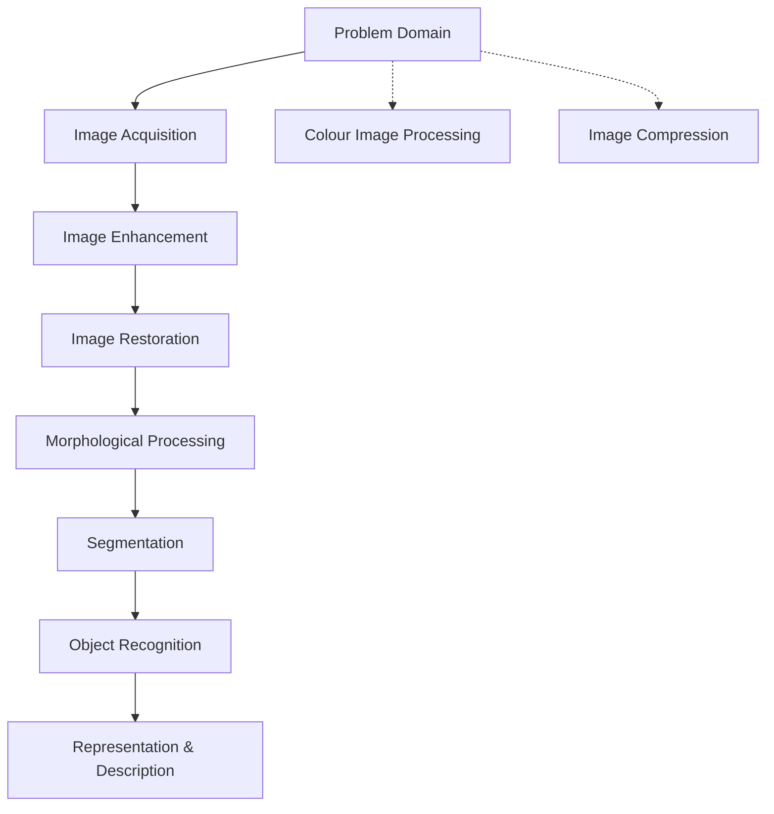

# What is a Digital Image?
- It is a representation of two-dimensional image in a set of digital values called pixels
- Pixel values represent gray levels, colors, heights opacities etc
- Common image formats include
	- B&W or Grayscale (1 sample per point)
	- Red, Green and Blue (3 sample per point)
	- Red, Green, Blue and Alpha (4 sample per point)

# What is digital image processing
## **Main Tasks**  

1. **Enhancing images for human interpretation**  

2. **Processing images for machine applications** (e.g., AI, automation)  

3. **Optimizing images for storage, transmission, and representation**  

  

## **Border Between Image Processing and Computer Vision**  

- Some debate exists about where **image processing ends** and where **image analysis & computer vision begin**.  

  

## **Key Image Processing Techniques**  

- **Noise filtering** – Removes unwanted distortions.  

- **Content enhancement** – Improves image quality for better interpretation.  

  - **Contrast enhancement** – Adjusts brightness levels.  

  - **Deblurring** – Sharpens blurry images.  

- **Remote sensing** – Uses image processing for satellite and aerial imagery.

## Stages in image processing

### 1. **Image Acquisition**
- The process of **capturing** images using devices like cameras or sensors.

- Converts real-world visuals into **digital form** for further processing.

### 2. **Image Enhancement**
- Improves image quality by adjusting **contrast, brightness, and sharpness**.

- Helps in **highlighting important details** for human perception.

### 3. Image Restoration

- Removes unwanted distortions like **blurring, noise, and motion artifacts**.

- Uses **mathematical models** to reconstruct the original image.

  

### 4. Morphological Processing

- Analyzes **image shapes and structures** using operations like **erosion, dilation, opening, and closing**.

- Useful for **object boundary detection** and **noise reduction**.

  

### 5. Segmentation

- Splits an image into **meaningful regions** (e.g., identifying objects in a scene).

- Techniques include **thresholding, edge detection, and region-based methods**.

  

### 6. Object Recognition

- Identifies and **classifies objects** within an image.

- Uses **AI, pattern matching, and machine learning** for recognition.

  

### 7. Representation & Description

- Converts recognized objects into **mathematical or symbolic forms** for further analysis.

- Used in applications like **facial recognition, medical imaging, and industrial automation**.