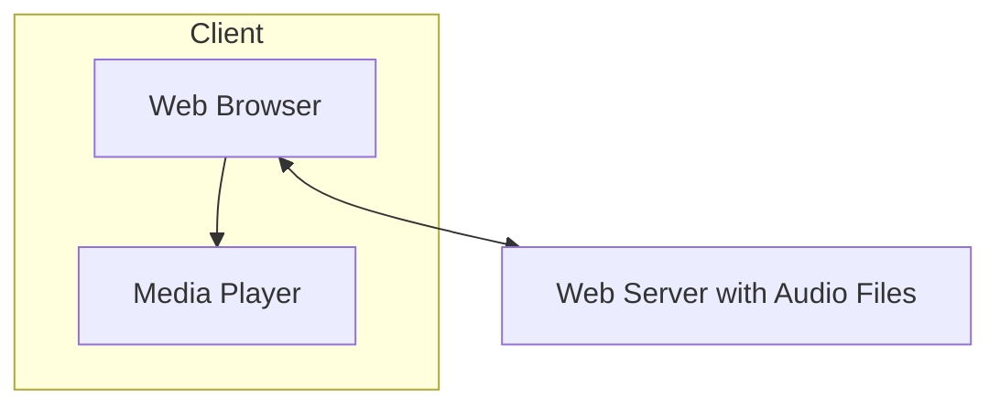
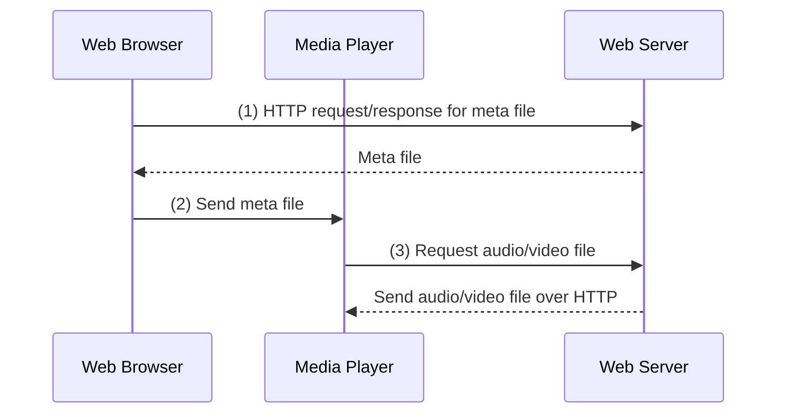
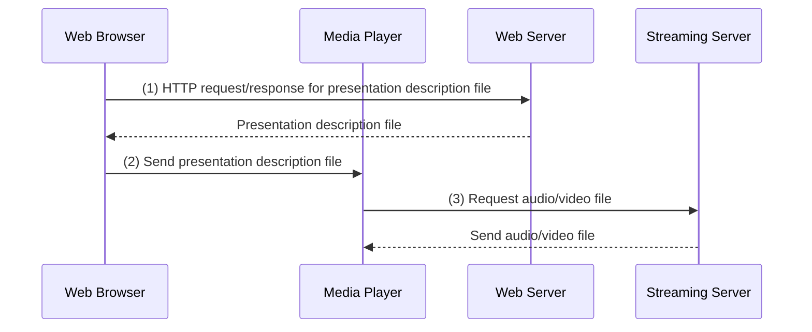

# Goals
## Principles
- Classify multimedia applications
- Identify the network services the apps need
- Making the best of best effort services
- Mechanisms for providing Qos

## Protocols and Architectures
- Specific protocols for use on a best-effort network
- Architectures for Qos

# Multimedia Networking

| Feature                    | Streaming Stored Multimedia                                       | Streaming Live Multimedia                                       | Interactive Real-Time Multimedia                                                    |
| -------------------------- | ----------------------------------------------------------------- | --------------------------------------------------------------- | ----------------------------------------------------------------------------------- |
| **Definition**             | Media is pre-recorded and stored at the source.                   | Media is broadcasted live as it happens.                        | Real-time interactive applications like IP telephony and video conferencing.        |
| **Client Playback**        | Begins before all data has arrived (buffered).                    | Playback lags but still follows timing constraints.             | Requires minimal delay for real-time interaction.                                   |
| **Interactivity**          | VCR-like functionality (pause, rewind, fast forward, slider bar). | Some interactivity: pause, rewind possible but no fast forward. | Highly interactive; fast forward and rewind are not applicable.                     |
| **Delay Tolerance**        | Initial delay of ~10 sec is acceptable.                           | Playback buffer causes lag (tens of seconds).                   | End-to-end delay must be < 150 ms for good experience, < 400 ms still acceptable.   |
| **Protocol Used**          | RTSP (Real-Time Streaming Protocol).                              | Often uses similar protocols but optimized for live streaming.  | Requires real-time communication protocols like RTP (Real-time Transport Protocol). |
| **Examples**               | Netflix, YouTube (on-demand content).                             | Internet radio, live sports broadcasts.                         | Zoom, Skype, online multiplayer games.                                              |
| **Timing Constraints**     | Data must arrive in time for playout.                             | Still requires timing constraints for seamless playback.        | Strict timing constraints to maintain interactivity.                                |
| **Session Initialization** | Not a major concern, as media is pre-stored.                      | Live stream setup requires encoding and broadcasting setup.     | Requires mechanisms to advertise IP, port, and encoding (e.g., SIP for VoIP).       |

# Streaming Stored Multimedia
Application-level streaming techniques for making the best out of services
- Client side buffering - Showing loading symbol while buffering
- Use of UDP over TCP
- Use multiple encoding of multimedia

## Simplest Approach

- Audio or Video are stored in files
- There are sent or transferred as HTTP objects
	- Sent as an entity to client and then passed to player
**Drawbacks**
- Audio or Video are not streamed
- No pipelining so it takes longer to play

## Streaming Approach

- Browser gets metafile
- Browser launches player and passed the metafile to the media player
- Media player contacts the server 
- Server streams the audio and video the player

## Streaming from a streaming server

- This allows for non-HTTP protocols between server and media player
- Can also use UDP instead of TCP